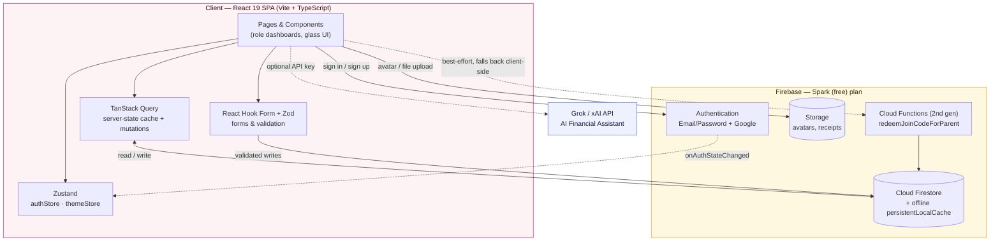
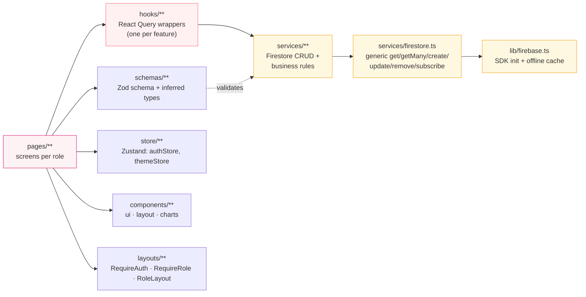
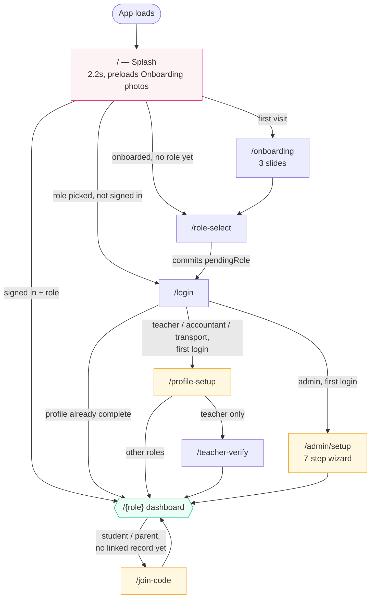
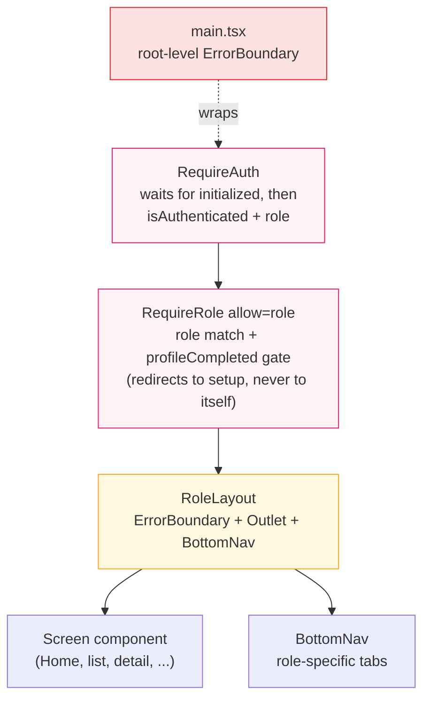
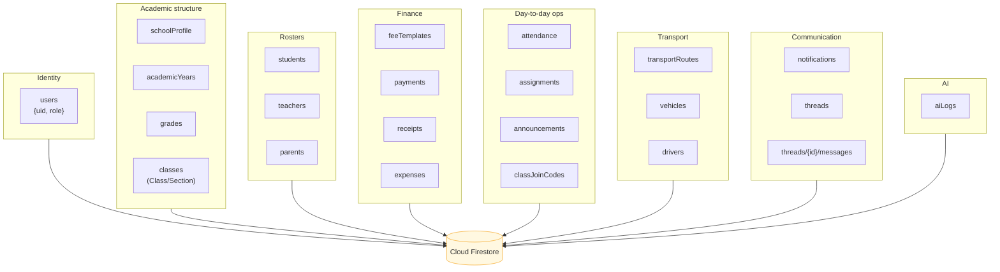
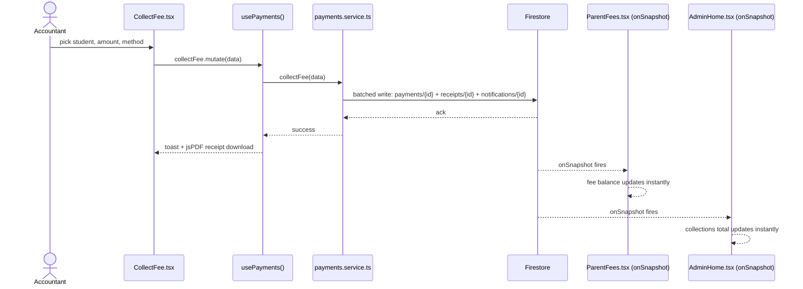
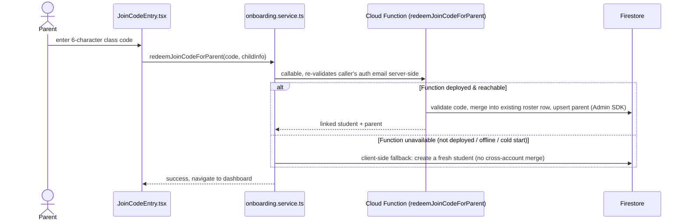

# Smart School FinTech

**Live Demo:** [https://finschool-idnm.vercel.app/](https://finschool-idnm.vercel.app/)

A mobile-first, glassmorphic school finance & operations platform — one app, six role-based
dashboards (Admin, Accountant, Teacher, Transport, Parent, Student), all backed by real-time
Firebase data.

<p align="left">
  
  
  
  
  
  
  
  
</p>

Every backend service used is on a free tier. The design system (glassmorphism, blush/rose
palette, Fraunces + Plus Jakarta Sans, spring animations via Framer Motion) is treated as a
fixed constraint — architecture changes wire real behavior behind it, never restyle it.

## Table of contents

- [Architecture](#architecture)
  - [System overview](#system-overview)
  - [Layered folder architecture](#layered-folder-architecture)
  - [Auth & routing flow](#auth--routing-flow)
  - [Route guard chain](#route-guard-chain)
  - [Data model](#data-model)
  - [Sequence: fee collection (real-time fan-out)](#sequence-fee-collection-real-time-fan-out)
  - [Sequence: join-code onboarding (Cloud Function + fallback)](#sequence-join-code-onboarding-cloud-function--fallback)
- [Feature matrix](#feature-matrix)
- [Roles & routes](#roles--routes)
- [Project structure](#project-structure)
- [Quick start](#quick-start)
- [Firebase setup guide](#firebase-setup-guide)
- [Environment variables](#environment-variables)
- [Deployment guide](#deployment-guide)
- [Design system](#design-system)
- [Security rules](#security-rules)
- [Offline behavior](#offline-behavior)
- [Error handling](#error-handling)
- [Known gaps / roadmap](#known-gaps--roadmap)

## Architecture

### System overview

The app is a single Vite-built SPA with no custom backend server — Firebase (Auth, Firestore,
Storage) is the entire backend, with one Cloud Function for a privileged cross-account write,
and an optional external AI API for the assistant feature.



**Why this shape:** no server means no server to operate, patch, or pay for. TanStack Query
owns all server-state caching/retry/invalidation so components stay declarative; Zustand only
holds truly global client state (auth session, theme) that isn't "data from the server."
Firestore's `onSnapshot` listeners (wrapped by hooks like `useNotifications`, `useStudents`,
`useThreads`) give free real-time fan-out — a payment collected by the Accountant appears on
the Parent's screen with zero polling.

### Layered folder architecture

Every feature follows the same vertical slice, so navigating one unfamiliar file tells you
where its siblings live.



One collection = one schema file + one service file + one hook. E.g. fee templates are
`schemas/feeTemplate.schema.ts` + `services/feeTemplates.service.ts` + `hooks/useFeeTemplates.ts`
— the same shape repeats for all ~20 collections, which is what keeps 60+ pages navigable.

### Auth & routing flow



Role is written once, at Role Select, to `users/{uid}.role` and never changes itself from the
client after that (only an admin can, per `firestore.rules`). `authStore.initialized` — set
once Firebase's `onAuthStateChanged` has fired for the first time — gates every guard below,
so a page refresh never flashes the login screen before the real session is restored.

### Route guard chain

Every role's dashboard subtree is wrapped by the same three-layer guard, so adding a new role
screen never has to re-implement auth/role/error handling.



Two `ErrorBoundary` instances exist by design: one around the whole router in `main.tsx` (catches
anything before routing even resolves), and one inside `RoleLayout` around just the `Outlet`
(so one broken dashboard screen shows a recoverable "Reload / Back to Home" card instead of
blacking out the bottom nav and the rest of the shell with it).

### Data model

Firestore is schemaless/NoSQL — this groups the ~20 collections by domain rather than drawing
false relational cardinality. Cross-collection links are plain string fields (`studentEmail`,
`guardianEmail`, `className`, `teacherId`), validated at the service layer, not by the database.



`className` (e.g. `"Class 5"`) is the join key threaded through most collections — a real
`classId` bridge exists on 5 of them (`joinCodes`, `attendance`, `assignments`, `announcements`,
`payments`) as forward-populating groundwork for a future read-side migration; see
[`PROGRESS.md`](./PROGRESS.md) for the exact staged rollout.

### Sequence: fee collection (real-time fan-out)

Illustrates why there's no polling anywhere: one write, three screens update.



### Sequence: join-code onboarding (Cloud Function + fallback)

A parent linking a child via a teacher-issued join code needs a privileged lookup (find an
admin-pre-registered student by class, across accounts) that Firestore rules correctly refuse to
a plain signed-in user. Rather than loosen the rules, a Cloud Function does that one lookup with
the Admin SDK — and the client degrades gracefully if the function isn't deployed yet.



## Feature matrix

| Area | What's real |
|---|---|
| Foundation | Design system, routing, auth guards, dark mode, root + per-role error boundaries |
| Admin | Student / Teacher / Parent CRUD, Academic Structure (School/Year/Grade/Class), Fee Templates → Firestore |
| Accountant | Fee collection, payment simulator (UPI/Card/Cash), PDF receipts, Expenses |
| Parent / Student | Live fees, receipts, attendance, transport status, Digital ID, join-code onboarding |
| Teacher | Attendance, assignments, announcements, student list, fee reminders, join codes |
| Transport | Vehicles, drivers, routes + live map (Leaflet/OSM), maintenance |
| QR | Generate (student ID + receipts + join codes), camera scan (jsQR) + manual fallback |
| Reports | Monthly/yearly/class-wise/revenue-wise, PDF + CSV export |
| Messaging | Real threaded messages (`threads`/`messages`), unread badges, read receipts |
| Notifications | Real-time Firestore (`onSnapshot`), unread badge, mark-read, delete |
| AI Assistant | Grok chat: revenue insights, fee prediction, reminders, NL search over live Firestore aggregates |
| Offline + security | Firestore offline persistence + online/offline banner; per-collection Firestore security rules |

See [`PROGRESS.md`](./PROGRESS.md) for the full increment-by-increment build log, including the
staged `classId` migration and its documented, deliberate scope cuts.

## Roles & routes

Every role subtree is mounted under `RequireAuth → RequireRole → RoleLayout` (see
[Route guard chain](#route-guard-chain)); the bottom-nav tabs are a subset of each subtree's
full route list.

| Role | Bottom-nav tabs | Other routes in this subtree |
|---|---|---|
| **Admin** | Home, Users, Finance, Reports, More | `/admin/setup`, `/admin/teachers`, `/admin/parents`, `/admin/academic-structure`, `/admin/scan`, `/admin/ai-assistant` |
| **Accountant** | Home, Collect, Finance, Reports, More | `/accountant/history`, `/accountant/expenses/:id`, `/accountant/scan`, `/accountant/ai-assistant` |
| **Teacher** | Home, Students, Attendance, Profile | `/teacher/assignments`, `/teacher/announcements`, `/teacher/fee-reminders`, `/teacher/join-codes` |
| **Transport** | Home, Vehicles, Routes, Profile | `/transport/maintenance`, `/transport/route-students/:routeId` |
| **Parent** | Home, Fees, Receipts, Profile | — |
| **Student** | Home, Fees, ID Card, Profile | — |

Every role also shares `notifications`, `messages`, `profile`, `settings`, `search`, `help`
(`withSharedRoutes()` in `App.tsx`) — defined once, mounted six times.

Pre-auth routes: `/` (Splash) · `/onboarding` · `/role-select` · `/login` · `/accounts`
(multi-account picker) · `/join-code` · `/profile-setup` · `/teacher-verify`.

## Project structure

```
src/
  components/
    ui/            # GlassCard, Button, BottomSheet, EmptyState, Skeleton, QRSheet, ...
    layout/        # BottomNav, TopBar, Screen
    charts/        # TrendChart, DonutChart
    ErrorBoundary.tsx
  layouts/         # RequireAuth / RequireRole / RequireAccount (guards), RoleLayout (shell)
  pages/           # admin/, accountant/, parent/, student/, teacher/, transport/, onboarding/, shared/
  hooks/           # one hook per Firestore-backed feature (useStudents, useNotifications, ...)
  services/        # Firestore CRUD per collection + firestore.ts, grokService, reports, receiptPdf
  schemas/         # Zod schema + inferred types, one per form/collection
  store/           # Zustand: authStore, themeStore
  lib/             # firebase.ts (SDK init + offline persistence), receiptPdf, reportPdf, csv, timeAgo
  constants/       # roles.ts, images.ts
  types/           # shared TypeScript types
functions/         # Cloud Functions (2nd gen) — redeemJoinCodeForParent, own package.json
scripts/           # checkImports.py (import-graph sanity check), backfillClassIds.ts (Admin SDK)
firestore.rules            # per-collection security rules
firestore.indexes.json     # composite indexes required by the app's queries
storage.rules               # Storage security rules
vercel.json                 # SPA rewrite (all routes → index.html)
```

## Quick start

```bash
npm install
cp .env.example .env      # fill in your Firebase + (optional) Grok keys — see below
npm run dev
```

Open the printed local URL and use your browser's device toolbar (390–430px) for the intended
mobile-first view.

```bash
npm run build     # tsc -b + production build
npm run lint      # eslint
npm run preview   # serve the production build locally
python scripts/checkImports.py   # import-graph sanity check (no compiler needed)
```

## Firebase setup guide

1. Go to the [Firebase Console](https://console.firebase.google.com) → **Add project** (the free Spark plan is enough).
2. **Authentication** → Sign-in method → enable **Email/Password** and **Google**.
3. **Firestore Database** → Create database → start in **test mode** (locked down by `firestore.rules` before going live — see [Security rules](#security-rules)).
4. **Storage** → Get started (default rules are fine to start; `storage.rules` in this repo tightens it).
5. Project settings → General → "Your apps" → Add a **Web app** → copy the config values into `.env` (see `.env.example`).
6. Install the Firebase CLI if you don't have it: `npm install -g firebase-tools`, then `firebase login`.
7. From the project root: `firebase init` (select Firestore + Storage + Functions, point to the existing `firestore.rules`, `firestore.indexes.json`, `storage.rules`, `functions/` in this repo — don't overwrite them), then:
   ```bash
   firebase deploy --only firestore:rules,firestore:indexes,storage,functions
   ```
   The Cloud Function requires the **Blaze** (pay-as-you-go) plan even at ~zero usage — see
   [Sequence: join-code onboarding](#sequence-join-code-onboarding-cloud-function--fallback);
   the app works without it, just without the cross-account roster merge.
8. (Optional, for the AI Assistant) Get a free key at [console.x.ai](https://console.x.ai) and set `VITE_GROK_API_KEY` in `.env`. Without it, the AI Assistant screen shows a "no API key yet" banner but the rest of the app works normally.

## Environment variables

See `.env.example` for the full list (Firebase web config + optional Grok key/model override +
optional local-emulator flag). Nothing is committed with real values.

## Deployment guide

Any static host works — this is a Vite SPA with no server component.

```bash
npm run build   # outputs to dist/
```

- **Vercel** (this repo ships `vercel.json` with the SPA rewrite already configured): connect the
  repo, build command `npm run build`, output directory `dist`, add the same environment
  variables from `.env` in the dashboard.
- **Firebase Hosting** (pairs naturally with the rest of the stack):
  ```bash
  firebase init hosting   # public directory: dist, configure as single-page app: yes
  firebase deploy --only hosting
  ```
- **Netlify**: same build command/output directory as Vercel, with an equivalent SPA-fallback redirect rule.

Whichever host you pick, without a rewrite/redirect rule that serves `index.html` for every
path, a hard refresh on a deep route (e.g. `/admin/setup`) 404s — client-side routing can't run
if the server never returns the app shell.

Remember to add your deployed domain to Firebase Authentication → Settings → Authorized
domains, or Google Sign-In will be rejected.

## Design system

- Palette: blush/pastel pink, rose, cream, peach, soft lavender — `tailwind.config.js`
- Glass surfaces: `.glass`, `.glass-card`, `.glass-pill`, `.glass-input` in `src/index.css`
- Dark mode via `useThemeStore`, applied through the `dark` class on `<html>`
- Fonts: Fraunces (display/headings) + Plus Jakarta Sans (body), via Google Fonts in `index.html`
- `#root` is capped at 430px with its own black backdrop — the deliberate "phone shell" look on
  wider viewports, not a bug

## Security rules

`firestore.rules` is per-collection rather than one broad catch-all — the rule shape mirrors the
domains in the [data model](#data-model) diagram:

- `users`: self-read/write own doc; admin can read/update any
- `students`: staff manage everything; a parent/student may read/write only the record matching
  their own auth email (`guardianEmail` / `studentEmail`) — enables self-service join-code
  onboarding without letting anyone touch another family's record
- `teachers` / `parents`: staff-managed; each person can read (not write) their own doc
- `classes`, `attendance`, `assignments`, `announcements`, `transportRoutes`, `vehicles`,
  `drivers`, `feeTemplates`, `classJoinCodes`: readable by any signed-in user (client filters to
  "my child's class"/"my route"), writable by staff only
- `schoolProfile` / `academicYears` / `grades`: signed-in read, **admin-only** write (stricter
  than `classes` — these define the school itself)
- `expenses`: admin/accountant only — not visible to parents, students, teachers, or transport
- `notifications`: locked to `targetEmail == request.auth.token.email` for read/update/delete
- `threads` / `messages`: locked to `participantEmails` — a user can only ever see threads they're
  actually part of; never deletable (`allow delete: if false`)
- `aiLogs`: staff-only create, self-attributed (`userEmail` must match the caller), never
  editable/deletable; read restricted to admins
- Everything else defaults to staff read+write, signed-in read

Deploy with `firebase deploy --only firestore:rules` after any change.

## Offline behavior

Firestore is initialized with `persistentLocalCache` (multi-tab) in `src/lib/firebase.ts`, so
reads are cached and writes queue locally when the network drops, then replay automatically on
reconnect — no data is lost. `useOnlineStatus` + `OfflineBanner` surface a small "you're
offline" / "back online, syncing…" pill globally without touching any existing screen's layout.

## Error handling

Two `ErrorBoundary` instances (see [Route guard chain](#route-guard-chain)) catch render-time
crashes and show a styled recovery card (apology, error message, Reload, Back to Home) instead of
a blank screen — one wraps the whole router in `main.tsx`, one wraps each role's `Outlet`
inside `RoleLayout`, so a single broken screen can't black out the entire app.

## Known gaps / roadmap

- **`classId` migration, read side**: 5 collections best-effort populate an optional `classId`
  alongside the legacy `className` string (write-side groundwork); the corresponding read-side
  migration (queries switching from `className` to `classId`) is intentionally not started — see
  [`PROGRESS.md`](./PROGRESS.md) for the staged plan and why it was deliberately deferred rather
  than attempted in one uncompiled pass.
- **Historical backfill**: `scripts/backfillClassIds.ts` (Admin SDK, idempotent) exists to
  backfill `classId` onto documents created before the bridge shipped — it needs to be run once
  against your own project; it can't run itself as part of a build.
- Full changelog, including every increment's explicitly-flagged scope cuts, lives in
  [`PROGRESS.md`](./PROGRESS.md).
